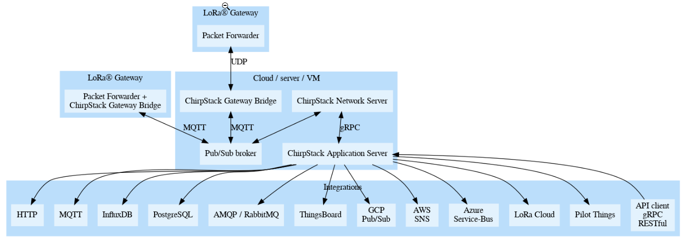

# ChirpStack Network Server Docker example

This repository contains a skeleton to setup the [ChirpStack](https://www.chirpstack.io)
open-source LoRaWAN Network Server stack using [Docker Compose](https://docs.docker.com/compose/).

**Note:** Please use this `docker-compose.yml` file as a starting point for testing
but keep in mind that for production usage it might need modifications. 

## Directory layout

* `docker-compose.yml` : the docker-compose file containing the services
* `docker-compose-env.yml` : alternate docker-compose file using environment variables, can be run with the docker-compose `-f` flag
* `configuration/chirpstack*` : directory containing the ChirpStack configuration files, see:
    * https://www.chirpstack.io/gateway-bridge/install/config/
    * https://www.chirpstack.io/network-server/install/config/
    * https://www.chirpstack.io/application-server/install/config/
    * https://www.chirpstack.io/geolocation-server/install/config/
* `configuration/postgresql/initdb/` : directory containing PostgreSQL initialization scripts
* `mqtts` : directory containing the `Dockerfile` to build the `mosquitto` container and the configuration required for setting up `MQTT` channel.
* `nginx` : directory containing `Dockerfile` and `setup.sh` files required to build the `nginx` container. 

## Configuration

The ChirpStack stack components are pre-configured to work with the provided
`docker-compose.yml` file and defaults to the `*IN865* LoRaWAN band`. Please refer
to the `configuration/chirpstack-network-server/examples` directory for more configuration
examples.

## Data persistence

PostgreSQL and Redis data is persisted in Docker volumes, see the `docker-compose.yml`
`volumes` definition.

## Requirements

Before using this `docker-compose.yml` file, make sure you have [Docker](https://www.docker.com/community-edition) and [Docker-composse](https://docs.docker.com/compose/install/ )
installed.
## ChirpStack architecture

## Build Setup

To build the docker-compose.yml file, there are some variables required in the `.env` file

### Create and edit the `.env` file

1. Edit the `.env` file as follows:

    1. `IOT_NETWORK_CERTBOT_FQDN=myhost.example.com`
    The domain(s) to be used by certbot when registering with Let's Encrypt.
    2. `IOT_NETWORK_NGINX_FQDN=myhost.example.com` The fully-qualified domain name to be served by NGINX.
    3. `IOT_NETWORK_CERTBOT_EMAIL=user@example.com` The email address to be used for registering with Let's Encrypt.
    4. `IOT_NETWORK_DATA=/var/opt/docker/data/`
    The trailing slash is required!
   This will put all the data file for this instance as subdirectories of the specified path. If you leave this undefined, `docker-compose` will print error messages and quit.


To start the ChirpStack open-source LoRaWAN Network Server stack, simply run:

```bash
$ docker-compose up -d --build
```

**Note:** during the startup of services, it is normal to see the following errors:

* ping database error, will retry in 2s: dial tcp 172.20.0.4:5432: connect: connection refused
* ping database error, will retry in 2s: pq: the database system is starting up

### Set up the `MQTT` User Credentials

To access mqtt channel, user needs credentials to access it.

1. Log into the `mosquitto` docker container.

   ```console
   $ docker-compose exec mosquitto /bin/bash
   #
   ```

2. In the container, Create username and password using `mosquitto_passwd` command. ( option `-c` - Create a new password file. If the file already exists, it will be overwritten. so `-c` should be used for the first user creation. please avoid `-c` for the second user creation onwards. )

   ```bash
   # mosquitto_passwd -c /etc/mosquitto/credentials/passwd <user>
   Password:
   Reenter password:
   ```

3. Close the connection to mqtts (Ctrl+D).

After all the components have been initialized and started, you should be able
to open `https://<IOT_NETWORK_NGINX_FQDN>` in your browser.

-   login with default username: `admin` and password: `admin`

## MQTTS Examples

Mqtts can be accessed in the following ways:

Method  |  Hostname/Path | Port | Credentials
--------|----------------|------|------------
MQTT over TLS/SSL | myhost.example.com | 8883 | Username/Password come from mosquitto’s configuration (password_file)
MQTT over TCP protocol (not secure so disabled for external access) | myhost.example.com | 1883 |Username/Password come from mosquitto’s configuration (password_file)

### Test MQTT Channels

- To test the `MQTT over TCP` and `MQTT over TLS/SSL` channels user can use [mosquitto client](https://mosquitto.org/download/) tool.

  - MQTT over TCP

      `Subscribing` mqtt channel on topic `test`

      ```bash
      mosquitto_sub -h myhost.example.com -t test -p 1883 -u user1 -P pwd123
      
      hello
      ```

      `publishing` on mqtt channel with topic `test`

      ```bash
      mosquitto_pub -h myhost.example.com -m "hello" -t test -p 1883 -u user1 -P pwd123
      ```

  - MQTT over TLS/SSL

      `Subscribing` mqtt channel on topic `test`

      ```bash
      mosquitto_sub -h myhost.example.com -t test -p 8883 -u user1 -P pwd123 --capath /etc/ssl/certs/
      
      hello 
      ```

      `publishing` on mqtt channel with topic `test`

      ```bash

      mosquitto_pub -h myhost.example.com -m "hello" -t test -p 8883 -u user1 -P pwd123 --capath /etc/ssl/certs/
      ```


### Refer ['setup.md'](./setup.md) for Configuring Network Server, Gateway and Device in Web-GUI

## Release History
- HEAD has the following changes
    - Getting Let's Encrypt cert via Nginx proxy and renewing it itself.
    - created a separate `mosquitto` container where the Let's Encrypt certs were used to secure mqtt communication on port `8883`

## Meta

### Contributions

This repository started from the ['brocaar/chirpstack-docker'](https://github.com/brocaar/chirpstack-docker) Chirpstack repository of commit [596df38fc64d40bf61af59a9c926893a78de24cd](https://github.com/brocaar/chirpstack-docker/commit/596df38fc64d40bf61af59a9c926893a78de24cd)

- [@brocaar](https://github.com/brocaar) and [@bconway](https://github.com/bconway) did a lot of work on improving the Chirpstack server setup.
- [@MuruganChandrasekar](https://github.com/MuruganChandrasekar) have added support to get Let's Encrypt cert via Nginx proxy and renew it itself. Also, created a separate `mosquitto` container where the Let's Encrypt certs were used to secure mqtt communication on port `8883`

There are many others, who have contributed code and also participated in discussions, performed testing, reported problems and results. Thanks to all who have participated.

### License
This repository is released under the MIT license. Commercial licenses are also available from MCCI Corporation.

### Trademark Acknowledgements

LoRa is a registered trademark of Semtech Corporation. LoRaWAN is a registered trademark of the LoRa Alliance.

MCCI and MCCI Catena are registered trademarks of MCCI Corporation.

All other trademarks are the properties of their respective owners.

### Support Open Source Hardware and Software

MCCI invests time and resources providing this open source code, please support MCCI and open-source hardware by purchasing products from MCCI, Adafruit and other open-source hardware/software vendors!

For information about MCCI's products, please visit [store.mcci.com](https://store.mcci.com/).

## Referrence

1. [ChirpStack Network Server](https://www.chirpstack.io)
