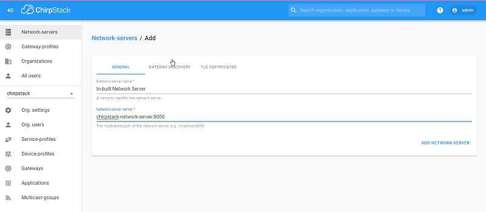
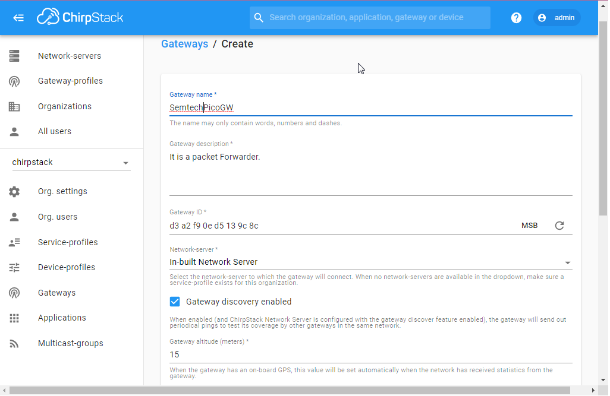
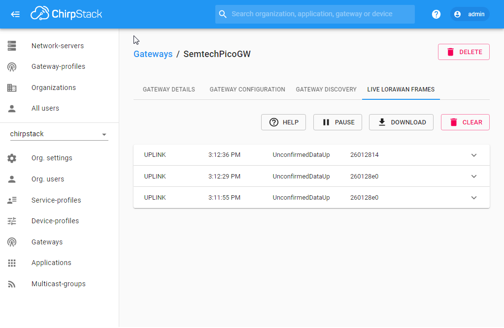
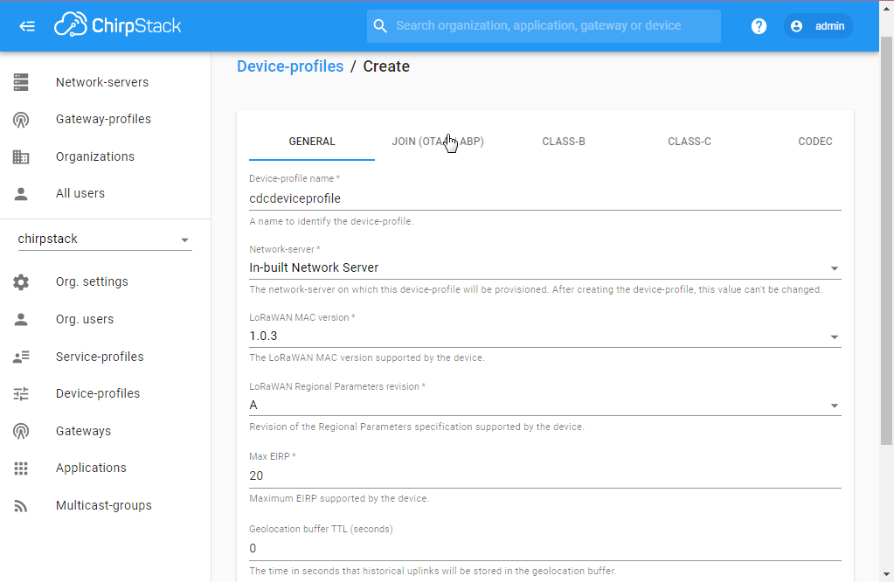
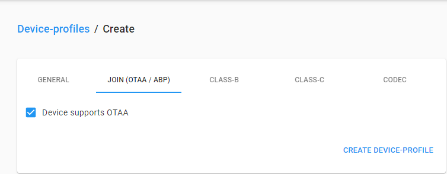
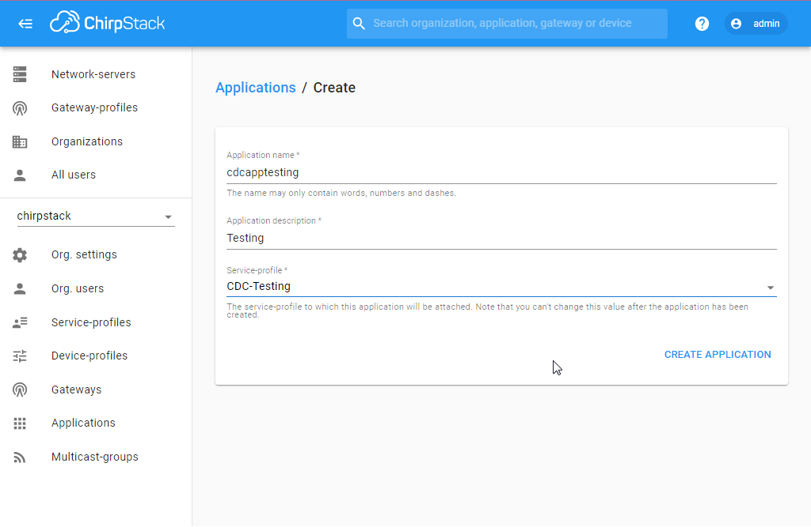
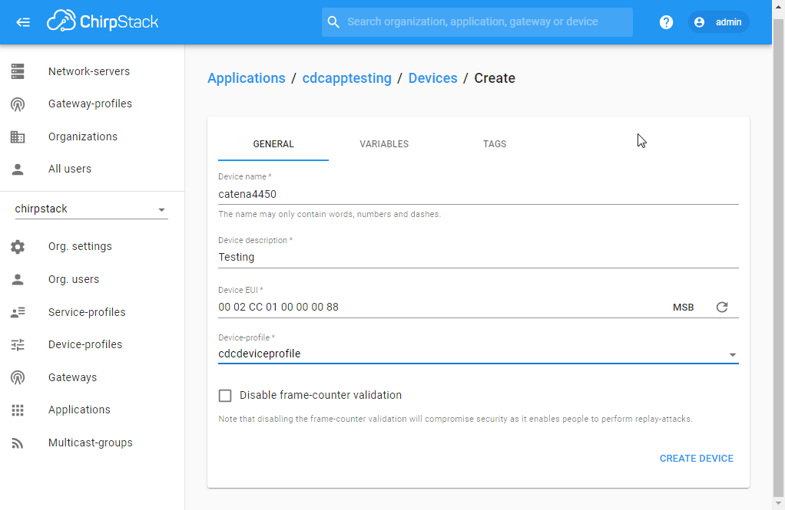
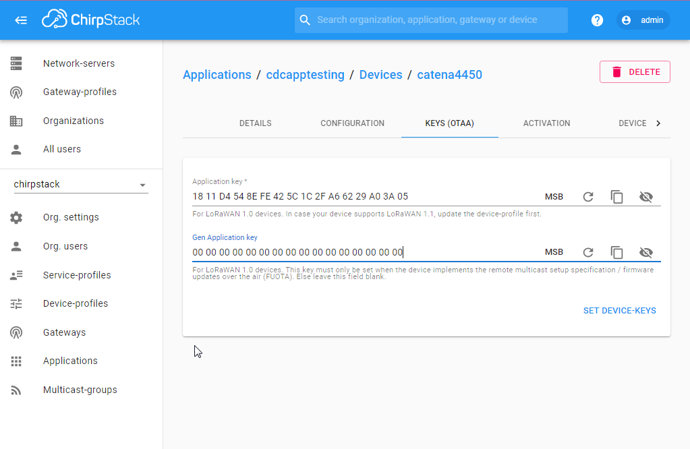
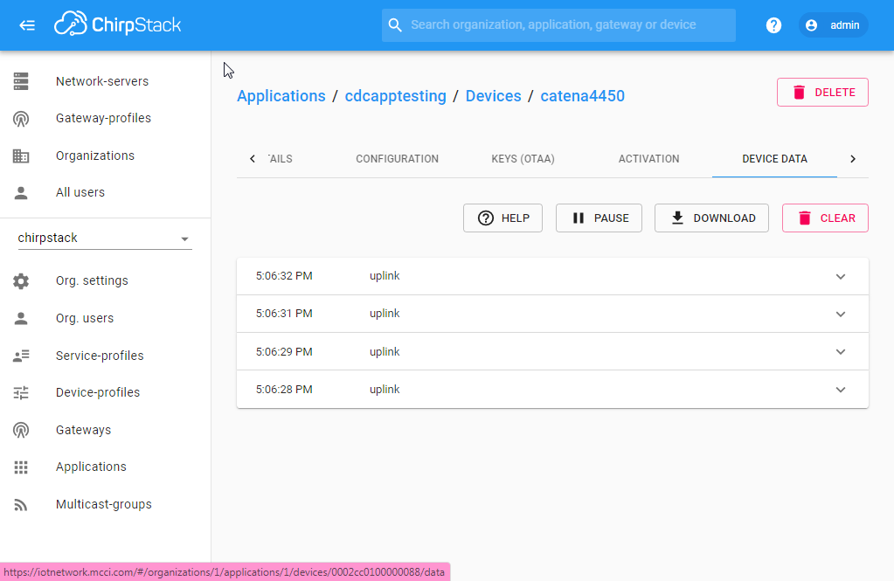

# ChirpStack - Configuring Network Server, Gateway and Device in Web-GUI

1. Click "Network-servers" in the sidetab and add "network server" as below:

    
2. Click "Service-profiles" in the sidetab and create a service profile for getting organizational access as below.

    
3. Click "Gateways" in the sidetab and create Gateway as below.( Gateway ID can be generated or else use your Gateway ID)

    
4. After Adding Gateway and it is configured in the Gateway side, the lorawan frames can be seen here in the "Live Lorawan Frames" tab as below:

    
5. Click "Device-profiles" in the sidetab and create "device profile" as below.

    
 5.1 In the "Join(OTAA/ABP)" tab, select "Device supports OTAA" as below:
    
    
6. Click "Applications" in the sidetab and create a application as below:
    
    
7. Once Application is Created, click the application-name in the list of applications to add add device as below:

    
 7.1 In the "KEYS(OTAA) tab, Generate "Application key" using spinning circle and make the "Gen Application key" to be "0" as below:

    
 7.2 After Generating the application keys and it is configured in the device side, the Device Data can be seen in the "Device DATA" tab as below:

    